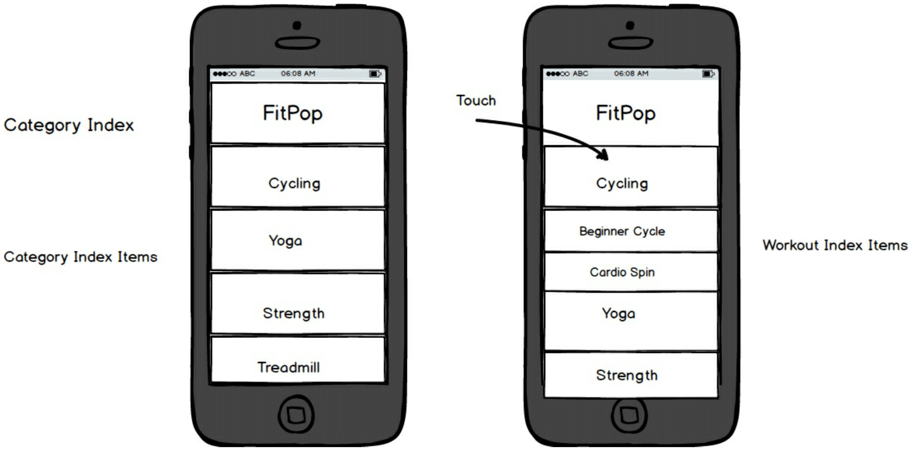

## FitPop

FitPop live

### Background

FitPop is an iOS music fitness app build with React Native, JavaScript and XCode. It syncs the motivation of a personal trainer with the perfect playlist to deliver an on-demand audio fitness experience.

### Features  

With this app, users are able to:

- [ ] Listen to playlist synced with workout audio
- [ ] Filter workouts by category
- [ ] Start and pause audio, and turn off and on volume

### Implementation
From the core React-Native library, FitPop utilizes React-Native UI Components such as `ListViewDataSource` to store the workout data and `NavigatorIOS` to navigate between the different components. It also leverages custom libraries such as `React-Native-Video`,`React-Native-Slider` and the `React-Timer-Mixin` for the audio Player, installed using `Node.js` and `XCode`.


##Categories
The landing page of the app is the `Category Index`. This Component loops through all Categories in the data and displays each as `Category Index Items`.

##CategoryIndexItem
Each `Category Index Item` displays the name of the workout as well as an `onPress()` listener which pushes on to navigator the `CategoryIndexDetail` and passes it props of the selected category.

##CategoryIndexDetail
This Component displays the Workouts associated with the Category and has a `onPress()` listener which redirects to the `Player` Component, passing in the selected workout as props.  

##Player

The `Player` plays the audio of the workout using `React-Native-Video` with audio controls to start, pause and turn off or on the volume. These attributes are store in the internal state of the `Player` as booleans and toggled based on user input.

The `Player` also features a Progress Bar which is created using the `React-Native-Slider`. Its current value is dictated by the current time and workout duration, which are also stored in the internal state of the `Player`.

When the user presses play, setInterval starts and updates the current time, causing the progress bar to re-render each second. Conversely, when the `Player` is paused or the Component unmounts, clearInterval is called.


### Wireframes




### Sample Data Object accessed by `ListViewDataSource`
```js
{
  name: "Spin",
  background: "https://res.cloudinary.com/dps0ohgkp/image/upload/v1479958530/bigstock-Fit-people-in-a-spin-class-at-105710492_riypmm.jpg",
  songs: [
    {
      title: "Beginner Spin",
      albumImage: "https://res.cloudinary.com/dps0ohgkp/image/upload/v1479958530/bigstock-Fit-people-in-a-spin-class-at-105710492_riypmm.jpg",
      url: "https://res.cloudinary.com/dps0ohgkp/video/upload/v1480019241/BeginnerSpin_zdaviq.mp3",
      songDuration: 1250
    },
  ]
}, ...

```

### Bonus features

- [ ] Track calories burned and heart rate using `react-native-apple-healthkit` library
